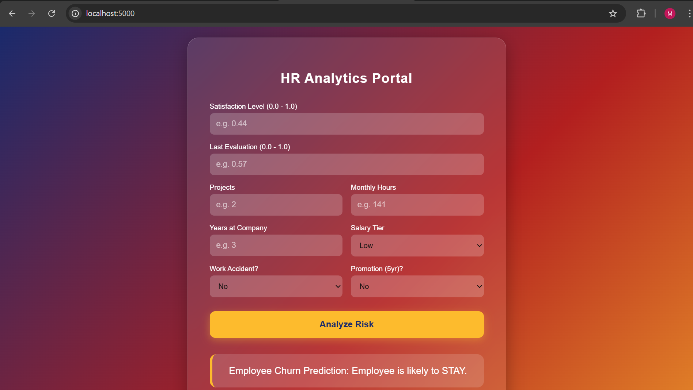
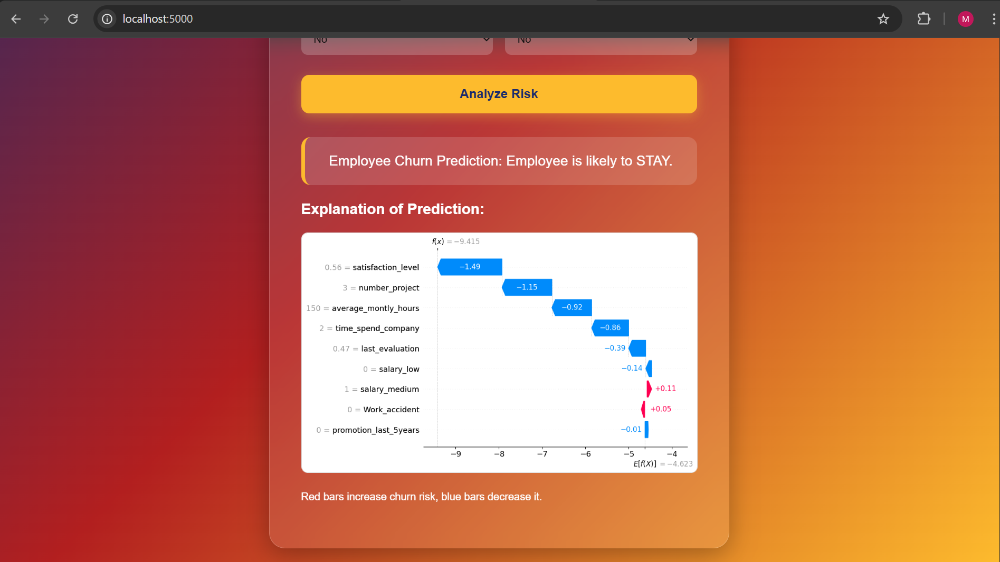

# Customer Churn Prediction with Explainable AI (XAI)

This project is a Machine Learning web application that predicts customer churn using **XGBoost** and explains predictions using **SHAP (SHapley Additive Explanations)**.

The application is built with:
- **Frontend:** HTML, CSS, JavaScript  
- **Backend:** Flask  
- **Machine Learning:** XGBoost, Random Forest  
- **Explainability:** SHAP  

## Project Overview

Customer churn prediction helps businesses identify customers who are likely to leave their service.

In this project:

- Performed churn prediction using a dataset (.csv file available in this repository)
- Compared Random Forest and XGBoost models
- Selected XGBoost based on better performance
- Integrated Explainable AI (XAI) using SHAP
- Built a complete end-to-end web application using Flask

## Model Performance

Two models were evaluated:

- **Random Forest Accuracy:** 91.66%
- **XGBoost Accuracy:** 99.06% 

Since XGBoost achieved higher accuracy, it was selected as the final trained model for deployment.

## Explainable AI (XAI)

This project uses **SHAP (SHapley Additive Explanations)** to provide interpretability.

SHAP helps to:

- Identify which features influenced the prediction
- Show whether a feature increased or decreased churn probability
- Improve model transparency
- Build trust in AI predictions

Instead of giving only a prediction result, the system also explains *why* that prediction was made.

## Dataset

- The dataset is available in this repository in `.csv` format.
- It contains customer-related features used for churn prediction.
- Data preprocessing, model training, and evaluation were performed before deployment.

## Application Workflow

1. User enters customer details in the web interface.
2. Flask backend sends data to the trained XGBoost model.
3. Model predicts:
   - Churn / Not Churn
4. SHAP generates feature importance explanation.
5. Results along with feature influence are displayed on the output screen.

